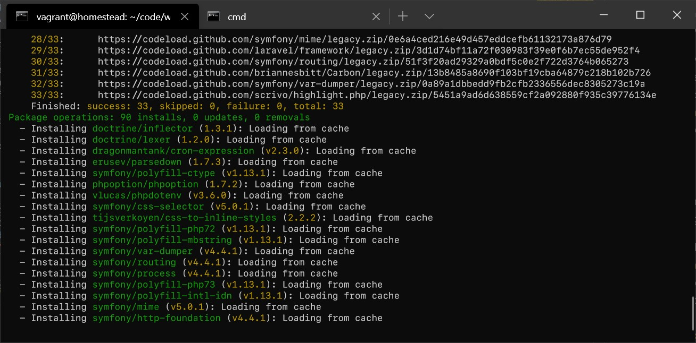

# Laravel 6.0 Installation Guide for Windows

## Pre-requisites

You must have the following installed and configured in order to do this:

* Vagrant: <https://www.vagrantup.com/>
* Virtualbox: <https://www.virtualbox.org/>
* Virtualization enabled in BIOS (Typically `AMD-V` or `VT-x`)
* I would recommend you have at least 4GB RAM and 4 cores so shit doesn't go south

## Installing the Box

1. Open CMD
2. Type `vagrant box add laravel/homestead`
3. When prompted, chose `3. Virtualbox`
4. Wait for the install to finish (typically takes at least 5 minutes on decent internet)

## Installing Laravel

1. Create a folder in a location of your choosing to install Laravel
2. Clone the Laravel repo: `git clone https://github.com/laravel/homestead.git`
3. cd into homestead folder
4. Switch to release `git checkout release`
5. Execute `init.bat`

## Configuring Homestead

1. Open `Homestead.yaml` in an editor
2. IP, Memory, CPU and Provider can be kept as default
3. Delete `keys` section.
4. The folders section maps the project source files between your local machine
   and the virtual machine. When choosing a path, make sure the host file path is in 
   the absolute path format: `C:\Users\MyUser\Documents\LaravelCode` is an example of such format.

5. The sites section contains the path to the public folder of the project source files. As well as the url that will be used to view the site.

## Configuring the Hosts File

Homestead requires you to modify the hosts file so you don't have to type in an IP to see your site. Fucky, I know:

1. Navigate to `C:\Windows\System32\drivers\etc`
2. Open the `hosts` file in an editor, this will require administrator privilages to edit.
3. Add a line to the hosts file which corresponds to the URL of the site you named in the `Homestead.yaml` file, and the IP of the homestead box. See the example image above.
4. Save the file.

## Initialising the Project Files

We must now clone the project repo and install all its dependencies. This will take some time depending on the performance of your system and your internet speed.

1. Within your terminal, navigate to the path of your homestead repo (where the `Homestead.yaml` file is located)
2. Type `vagrant up` to launch the homestead VM, wait for it to complete
3. Once up, type `vagrant ssh` to connect to the VM.
4. You should see the bash terminal prompt, `cd` to the folder you chose for the project files (`/home/vagrant/code`)
5. Clone the repo: `git clone https://github.com/KyleBow21/pm_system`
6. `cd` into the source files.
7. Type `composer install`, this will begin installing all the dependancies for Laravel.

8. You are now ready to start editing files.

## Setting up the .env File

The .env file contains all the settings that Laravel uses for database connections and miscellaneous project features. It must be present in order for the site to work. The project repo comes with an env.example file which contains the default settings used by Laravel. There's only one thing we need to configure in order for it to work properly.

1. Open the project folder in your preferred editor.
2. Rename the `env.example` file to `.env`
3. Open the `.env` file
4. The only thing we need to change is `DB_DATABASE`, `DB_USERNAME` and `DB_PASSWORD`. Change them as follows:
    * `DB_DATABASE=homestead`
    * `DB_USERNAME=homestead`
    * `DB_PASSWORD=secret`

## Miscellaneous Commands

There are a few commands that are useful when developing with Laravel and Homestead. The following is a concise rundown of each that you should probably know, but all documentation is available online at <https://laravel.com/docs/6.x/>

### Vagrant Commands

* `vagrant up`: Starts the VM
* `vagrant down`: Stops the VM
* `vagrant reload`: Reboots the VM
* `vagrant reload --provision`: Reloads and provisions the VM (Do this every time you want to reboot the VM, as it reloads all configuration files.)

### Laravel Commands

All the laravel commands that can be executed in the project folder are prefixed with `php artisan`:

* `php artisan migrate:fresh`: Drop and re-create all databases with no data.
* `php artisan migrate:fresh --seed`: Same as above, but run the seeders to populate the database.
* `php artisan make`: Basically the main command used for Laravel, if you run this you can see all the commands used with make to create whatever you want.
